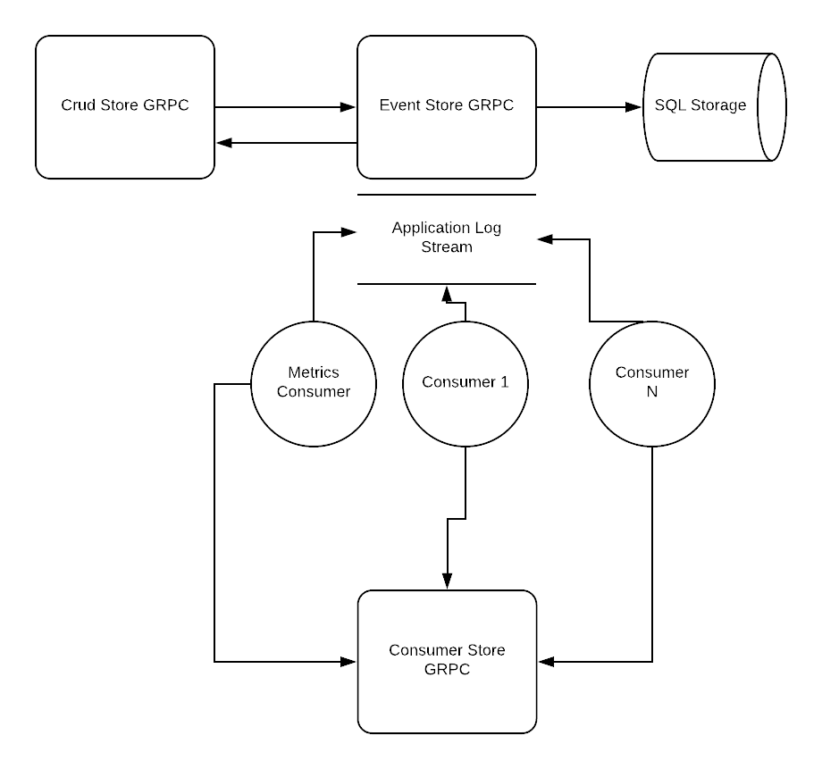

## ESKIT (Event Sourcing Kit) Microservice Example 

It consists of 3 service : 

- EventStore
- CrudStore 
- Metrics Consumer

#### What is ESKIT Microservices:

- Event Sourcing Service (Append, Get operations) with Application Log (from Vaughn Vernon's book)
- CRUD Service : Uses ES service with predefined event types and does the replay for the user.
- Consumer Service to track the progress of Application Log
- Go and Python consumers to process the events from ES and Application Log
- It's an easy way to have CQRS with consumers and event logs easily.
- Makefile with lots of cool automations.
- Supports both GRPC and REST (grpc-gw). 

#### What ESKIT Microservices is not

- It's not an Event Sourcing Framework
- It's not production ready
- It's not fast as Kafka.

### Architecture Overview

The example itself consists of 2 microservices and 1 consumer

- Event Store
- Crud Store
- Metrics Consumer

## Event Store Service

Event Store Service is an append only service where users can append predefined event data. It supports the usual
2 operations `Append` and `Get`. It also adds a new concept called Application Log which is like an event stream (Kafka).
Every time a new `Append` request is sent the event is written to event store and application log at the same time in the 
same transaction. This is a trade off the service accepts in order to keep things simple instead of trying to implement
distributed transactions and etc. Consumers can poll/stream (`LogsPoll`) on that Application Log and process all the events flowing through
the system. The consumers are responsible for storing the offset of their their progress. 

## Crud Store Service

Crud Store service is built on top of Event Store Service and uses it as data storage. It supports 4 basic CRUD operations
and some listing capabilities. In general when implement Event Sourcing systems you have to have handlers that replay the events and create the 
current state of the entities. What Crud Store does is, it has 3 (`Created`, `Updated`, `Deleted`) predefined event types and tries to do the replay for the user.
On client facing side the user only sees real objects and no events, it's like a NoSQL database with history. When an update operation is
sent only diff of previous state and new state is saved to the event store Event Store. Under the hood Crud Store uses `JSON Merge Patches` to replay the objects from 
the diffs. Using Crud Store is totally optional, user can just use Event Store and do the replay by herself. 
Currently Crud Store doesn't support Snapshotting, something to be added in the future.

Crud Store works with Json Payloads for CRUD operations. ESKIT also includes a Go client which works at Protobuf (Golang struct)
level and does all the JSON conversion for the user.

## Metrics Consumer

Metrics Consumer is an example implementation of how to write consumers to process the Application Log.
Currently, it reads all the events flowing and saves the metrics to Prometheus. Project has grafana dashboards
which can display some interesting facts about the events flowing in the systems.

General Microservice Architecture looks like :

 
## To Run It Locally:

##### Requirements :
- docker
- docker-compose

##### Run Tests Locally (in docker compose):
- `make test`

##### Deploy to Docker Compose Locally  :
- `make deploy`

